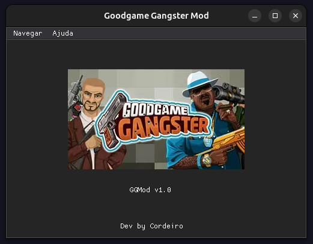
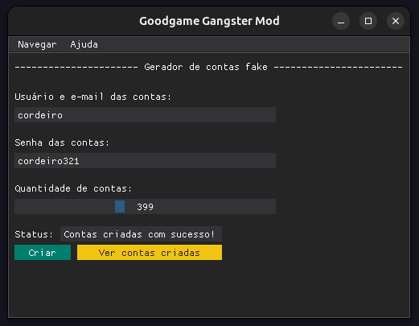

# Goodgame Gangster Mod
Projeto com intuito de criar mods para o Goodgame Gangster

### Demonstração do projeto:

### Observação

Todos os fins são apenas educacionais e não visam prejudicar o jogo ou seus desenvolvedores. O GGMod é um projeto open-source e seu uso é de responsabilidade do usuário e o desenvolvedor não se responsabiliza por qualquer dano causado pelo uso do mod.

### Comando para fazer build:
pyinstaller --onefile --windowed --icon=assets/gg.ico --name GGMod main.py
